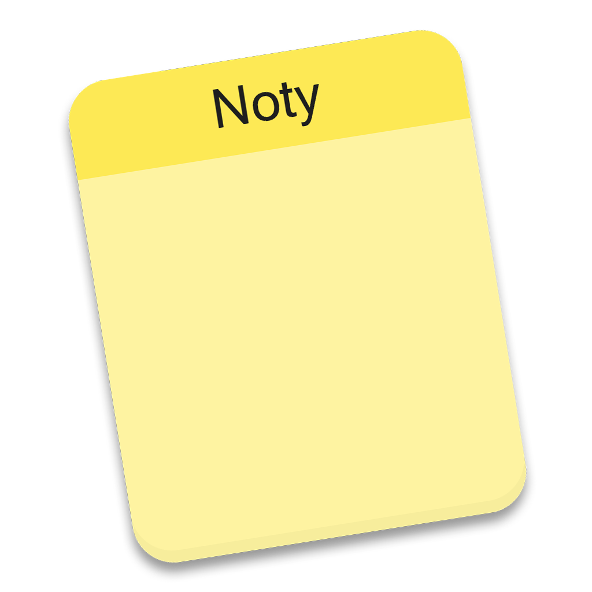
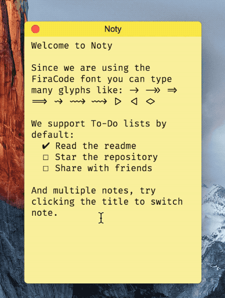
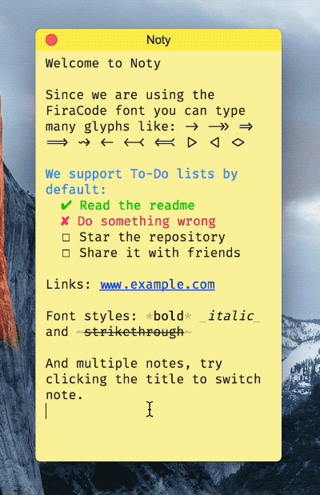

# Noty ([DOWNLOAD](https://github.com/fabiospampinato/noty/releases))

<p align="center">
  
</p>

Autosaving sticky note with support for multiple notes without needing multiple windows.

## Features

- Supports multiple notes without needing multiple windows.
- Auto-saves your notes.
- To-Do functionalities built-in.
- Links support.
- Bold/code/italic/strikethrough support.
- Multiple cursors.
- Find and Replace.
- Programmers shortcuts.
- Uses the [FiraCode](https://github.com/tonsky/FiraCode) font.

## Shortcuts

> **Note:** The following are macOS shortcuts, if you're using a different OS replace <kbd>Cmd</kbd> with <kbd>Ctrl</kbd>, or <kbd>Alt</kbd> if <kbd>Ctrl</kbd> is already used.

- <kbd>Cmd+N</kbd> - Create a new note.
- <kbd>F2</kbd> - Rename the current note.
- <kbd>Cmd+Alt+Backspace</kbd> - Delete the current note.
- <kbd>Tab</kbd> - Indent current line.
- <kbd>Shift+Tab</kbd> - Outdent current line.
- <kbd>Cmd+F</kbd> - Find.
- <kbd>Cmd+G</kbd> - Find next.
- <kbd>Cmd+Shift+G</kbd> - Find previous.
- <kbd>Cmd+Shift+H</kbd> - Replace.
- <kbd>Cmd+Shift+Alt+H</kbd> - Replace all.
- <kbd>Cmd+Ctrl+Up</kbd> - Move current line up.
- <kbd>Cmd+Ctrl+Down</kbd> - Move current line down.
- <kbd>Alt+Click</kbd> - Add a new cursor.
- <kbd>Cmd+Click</kbd> - Open the clicked link.
- <kbd>Cmd+Enter</kbd> - Toggle a todo's box symbol.
- <kbd>Alt+D</kbd> - Toggle a todo's done symbol.
- <kbd>Alt+C</kbd> - Toggle a todo's cancelled symbol.
- <kbd>Cmd+B</kbd> - Toggle bold.
- <kbd>Cmd+`</kbd> - Toggle code.
- <kbd>Cmd+I</kbd> - Toggle italic.
- <kbd>Cmd+S</kbd> - Toggle strikethrough.
- <kbd>Cmd+1/9</kbd> - Select the 1st/9th note.
- <kbd>Cmd+Alt+Right</kbd> - Select the next note.
- <kbd>Ctrl+Tab</kbd> - Select the next note.
- <kbd>Cmd+Alt+Left</kbd> - Select the previous note.
- <kbd>Ctrl+Shift+Tab</kbd> - Select the previous note.

## Demo

Switching note:



New note and rename:



## Contributing

If you have an idea, or found an problem, please open an [issue](https://github.com/fabiospampinato/noty/issues) about it.

If you want to make a pull request, or fork the app, you should:

```bash
git clone https://github.com/fabiospampinato/noty.git
cd noty
npm install
npm run dev
```

## Related

- **[vscode-todo-plus](https://marketplace.visualstudio.com/items?itemName=fabiospampinato.vscode-todo-plus)**: Visual Studio Code extension that implements the same To-Do functionalities, and much more.
- **[Notable](https://github.com/fabiospampinato/notable)**: The markdown-based note-taking app that doesn't suck.

## License

MIT © Fabio Spampinato
